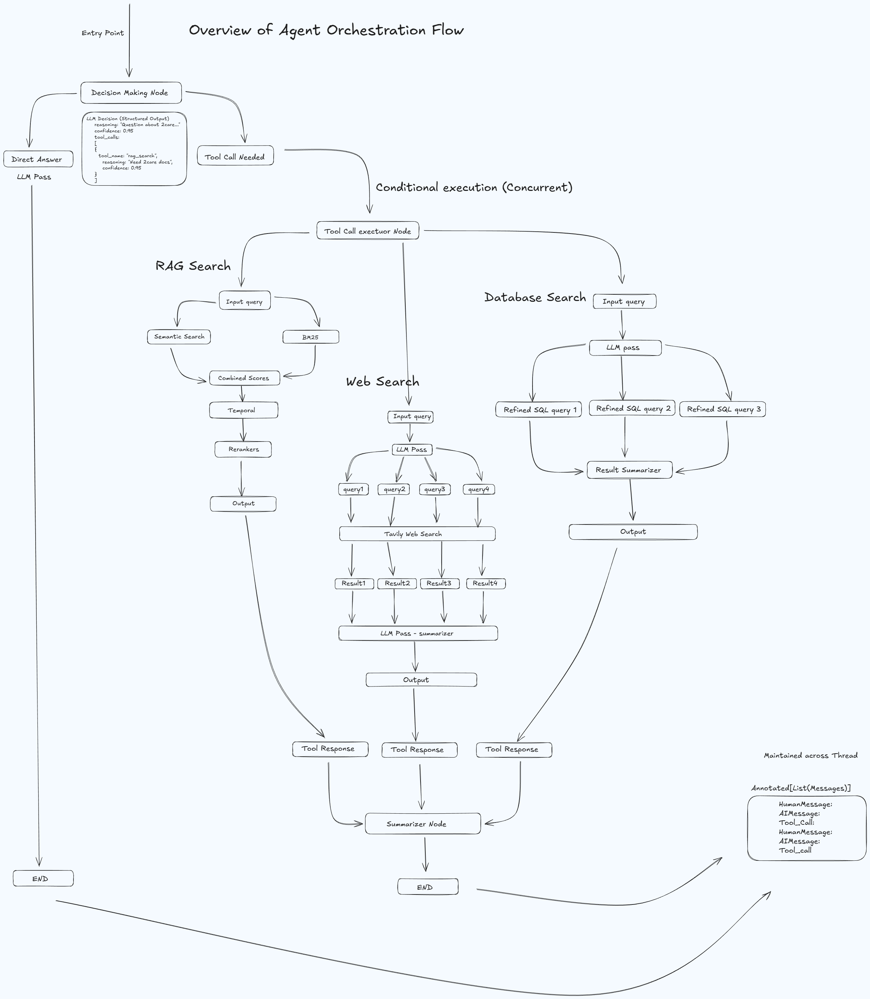

# Enterprise RAG Agent

An intelligent enterprise assistant built with LangGraph that orchestrates multiple information retrieval tools to provide comprehensive answers from internal documentation, web sources, and structured databases.

## Architecture



The system follows a decision-driven workflow where an LLM-based decision node determines which tools to invoke, executes them in parallel, and synthesizes results into coherent responses.

## System Overview

The Enterprise RAG Agent is a multi-tool orchestration system that intelligently routes queries through specialized search mechanisms:

- **Decision Node**: Analyzes user queries using structured LLM output to determine which tools are needed
- **Parallel Tool Execution**: Executes selected tools concurrently for optimal performance
- **Synthesis Node**: Combines results from multiple sources into a unified, coherent response
- **Persistent Memory**: Maintains conversation context across interactions using PostgreSQL or in-memory storage

## Core Capabilities

### 1. RAG Search (Retrieval-Augmented Generation)
- **Hybrid Search**: Combines semantic (vector) and keyword (BM25) search for optimal retrieval
- **Temporal Filtering**: Filters documents by date ranges extracted from queries
- **Recency Boosting**: Prioritizes more recent documents in search results
- **Reranking**: Optional Cohere-based reranking for improved relevance

### 2. Web Search
- **Query Reformulation**: Generates multiple search angles using LLM
- **Multi-Query Execution**: Executes parallel searches for comprehensive coverage
- **Result Deduplication**: Removes duplicate URLs across search results
- **Intelligent Summarization**: Organizes and synthesizes web results

### 3. Database Query
- **Structured Data Access**: Queries Supabase for user data, orders, and structured information
- **SQL Generation**: Converts natural language queries to database operations

## Project Structure

```
assignment-ly/
├── agent/                    # Agent orchestration components
│   ├── agent.py             # Main EnterpriseAgent class and LangGraph workflow
│   ├── decision_node.py     # LLM-based tool selection logic
│   ├── tool_executor.py     # Parallel tool execution engine
│   ├── synthesis_node.py    # Result synthesis and final answer generation
│   ├── memory_manager.py    # Checkpoint persistence (PostgreSQL/Memory)
│   └── tools.py             # Tool definitions (RAG, Web, Database)
│
├── rag_query/               # RAG system implementation
│   ├── hybrid_search.py     # Hybrid search (BM25 + Vector) with temporal filtering
│   ├── rag_query_system.py  # RAG query orchestration and answer generation
│   ├── reranker.py          # Cohere-based document reranking
│   └── intent_classifier.py # Query intent classification
│
├── data_ingestion/          # Data processing and vectorization
│   ├── documents.py         # Document processing and chunking
│   ├── embeddings.py        # Voyage AI embedding provider
│   ├── vector_store.py      # ChromaDB vector store abstraction
│   └── inject_data.py       # Data ingestion pipeline
│
├── prompts/                 # LLM prompt templates
│   ├── decision_prompt.py   # Tool selection decision prompt
│   ├── rag_query_prompt.py # RAG answer generation prompt
│   ├── synthesis_prompt.py # Multi-source synthesis prompt
│   ├── date_extraction_prompt.py # Temporal information extraction
│   └── web_search_*.py     # Web search reformulation and polishing prompts
│
├── lib/                     # External service clients
│   ├── chroma_client.py     # ChromaDB Cloud client configuration
│   └── supabase_client.py   # Supabase database client
│
├── api/                     # FastAPI REST interface
│   └── main.py              # API endpoints and server configuration
│
├── data/                    # Enterprise knowledge base
│   └── *.txt                # Company documentation and metadata
│
└── scripts/                 # Utility scripts
    ├── inject_data_script.py # Data ingestion script
    └── query_rag.py         # RAG query testing script
```

## Technology Stack

### LLM Providers
- **Groq**: Primary LLM provider for decision-making, synthesis, and general queries
- **Google Generative AI**: Alternative LLM provider (Gemini models)

### Embedding & Vector Search
- **Voyage AI**: High-quality embeddings (voyage-large-2 model)
- **ChromaDB**: Vector database for semantic search (Cloud or local)

### Search & Retrieval
- **BM25**: Keyword-based search via rank-bm25
- **Cohere**: Document reranking for improved relevance

### Web Search
- **Tavily**: Real-time web search API

### Database
- **Supabase**: PostgreSQL-based database for structured queries
- **PostgreSQL**: Persistent conversation memory via LangGraph checkpoints

### Framework & Orchestration
- **LangGraph**: Agent workflow orchestration
- **LangChain**: LLM abstraction and tool integration
- **FastAPI**: REST API framework

## API Integrations

| Service | Purpose | Authentication |
|---------|---------|----------------|
| **Groq API** | LLM inference for decision-making, synthesis, and query processing | `GROQ_API_KEY` |
| **Voyage AI** | Text embeddings for semantic search | `VOYAGE_API_KEY` |
| **ChromaDB Cloud** | Vector database for document storage and retrieval | `CHROMA_DB_API_KEY`, `CHROMA_TENANT` |
| **Tavily** | Real-time web search | `TAVILY_API_KEY` |
| **Cohere** | Document reranking | `COHERE_API_KEY` |
| **Supabase** | Structured database queries | `SUPABASE_URL`, `SUPABASE_SERVICE_ROLE_KEY` |
| **Google Generative AI** | Alternative LLM provider | `GOOGLE_GENERATIVE_AI_API_KEY` |

## Key Features

### Intelligent Tool Selection
The decision node uses structured LLM output to analyze queries and select appropriate tools with confidence scores. Supports:
- Single tool execution
- Multi-tool parallel execution
- Direct answers for simple queries

### Hybrid Search Architecture
- **Semantic Search**: Vector similarity using Voyage AI embeddings
- **Keyword Search**: BM25 algorithm for exact term matching
- **Score Fusion**: Configurable alpha blending (default: 0.5)
- **Temporal Awareness**: Date-based filtering and recency boosting

### Parallel Execution
All selected tools execute concurrently using `ThreadPoolExecutor`, significantly reducing response time for multi-tool queries.

### Conversation Memory
- Persistent state management via LangGraph checkpoints
- PostgreSQL backend for production deployments
- In-memory fallback for development

### Error Resilience
- Graceful degradation when tools fail
- Comprehensive error handling with user-friendly messages
- Timeout protection (60s per tool)

## Workflow

1. **Query Reception**: User query enters the system
2. **Decision Making**: LLM analyzes query and selects tools with confidence scores
3. **Tool Execution**: Selected tools execute in parallel
   - RAG search retrieves from vector database
   - Web search queries external sources
   - Database search queries structured data
4. **Synthesis**: LLM combines all tool results into a unified answer
5. **Response**: Final answer returned with source citations

## Dependencies

Core dependencies are managed via `requirements.txt`:
- `langchain-*`: LangChain ecosystem for LLM integration
- `langgraph`: Workflow orchestration
- `chromadb`: Vector database
- `rank-bm25`: Keyword search
- `cohere`: Document reranking
- `tavily-python`: Web search
- `supabase`: Database client
- `fastapi`: API framework
- `colorama`: Terminal color output

## Design Principles

- **Minimal Complexity**: Avoids over-engineering while maintaining flexibility
- **Fault Tolerance**: Graceful error handling and fallback mechanisms
- **Performance**: Parallel execution and efficient caching
- **Maintainability**: Clear separation of concerns and modular architecture
- **Extensibility**: Easy to add new tools or modify existing ones

